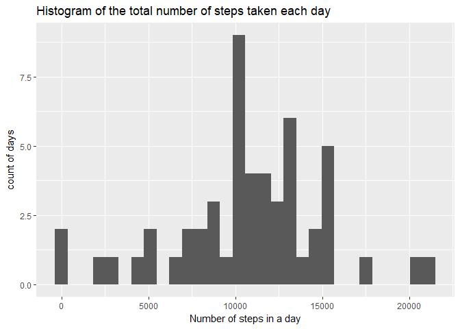
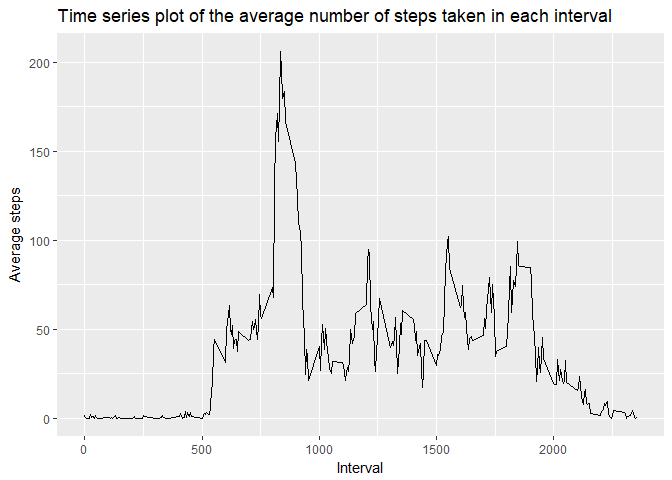
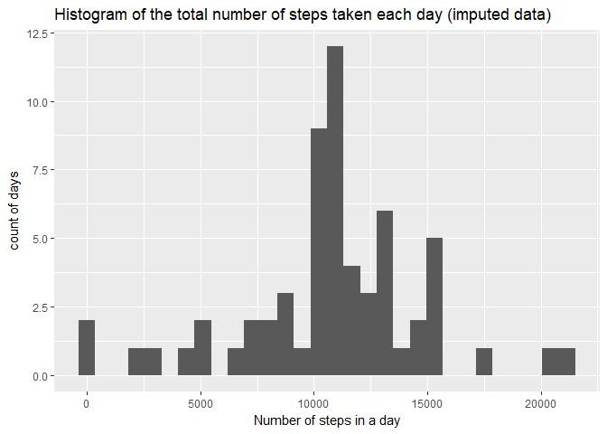
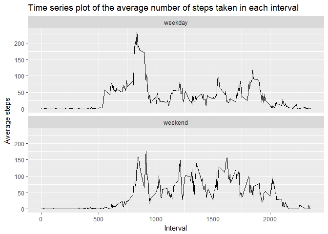

## Loading and preprocessing the data

### Load data


```r
dat_raw <- read.csv(unz("activity.zip", "activity.csv"))
```

### Load the required packages and set global options


```r
library(ggplot2)
library(knitr)
```

```
## Warning: package 'knitr' was built under R version 3.4.4
```

```r
opts_chunk$set(warning = FALSE, message = FALSE) #turn off messages and warnings
```


## What is the mean total number of steps taken per day?


```r
dailysteps <- aggregate(steps ~ date,
                        dat_raw, 
                        FUN=sum)
```

### Histogram of the total number of steps taken each day


```r
plot1 <- ggplot(data = dailysteps, aes(dailysteps$steps)) +
                geom_histogram() +
                labs(title = "Histogram of the total number of steps taken each day") +
                labs(x = "Number of steps in a day", y = "count of days")
plot1
```

<!-- -->

Note that this omits some days for which no valid data on the number of steps was recorded.


### Mean and median of the total number of steps taken per day


```r
meansteps <- mean(dailysteps$steps)
mediansteps <- median(dailysteps$steps)
```

The mean number of steps taken per day is 1.0766189\times 10^{4}.  
The median number of steps taken per day is 10765.


## What is the average daily activity pattern?


```r
intervalsteps <- aggregate(steps ~ interval,
                        dat_raw, 
                        FUN=mean)
```


### Plot of the average number of steps per 5 minute interval


```r
plot2 <- ggplot(data = intervalsteps, aes(x = interval, y = steps)) +
                geom_line() +
                labs(title = "Time series plot of the average number of steps taken in each interval") +
                labs(x = "Interval", y = "Average steps")
plot2
```

<!-- -->

### Which interval contains, on average, the most steps?


```r
maxsteps <- max(intervalsteps$steps) # find the maximum number of steps in an interval
maxinterval <- intervalsteps$interval[intervalsteps$steps == maxsteps] # select the interval with the max number of steps
```

The 5 minute interval that contains, on average across all days, the maximum number of steps, is interval 835


## Imputing missing values

### How many missing values are in the dataset?


```r
NArow <- nrow(dat_raw) - sum(complete.cases(dat_raw))
```

There are 2304 rows with missing values in the dataset.


### Devise a strategy for imputing missing values and create new dataset with missing values filled in

Strategy: I imputed missing values using the mean value for that 5-minute interval
The code below creates a new dataset that has the missing values filled in, using this strategy.


```r
# Extract the IDs of the NA rows in the raw dataset
na_id <- which(is.na(dat_raw$steps))

# Merge raw data with interval averages data previously calculated:
merged <- merge(dat_raw, intervalsteps, by = "interval", suffixes = c(".raw", ".intsteps"))

# Order the merged table by date, interval, and reorder rownames so that IDs match those of the NA rows extracted from the raw dataset
merged2 <- merged[with(merged, order(date, interval)), ]
row.names(merged2) <- NULL

# Create a new dataset and impute the interval averages for NA values
impute_df <- dat_raw
impute_df[na_id, "steps"] <- merged2[na_id, "steps.intsteps"]
```


### Histogram of the total number of steps taken each day using the new dataset


```r
dailystepsimp <- aggregate(steps ~ date,
                           impute_df, 
                           FUN=sum)

plot3 <- ggplot(data = dailystepsimp, aes(dailystepsimp$steps)) +
                geom_histogram() +
                labs(title = "Histogram of the total number of steps taken each day (imputed data)") +
                labs(x = "Number of steps in a day", y = "count of days")
plot3
```

<!-- -->

### Mean and median of the total number of steps taken per day using the new dataset


```r
meanstepsimp <- round(mean(dailystepsimp$steps), 0)
medianstepsimp <- round(median(dailystepsimp$steps), 3)
```

The mean number of steps taken per day is 1.0766\times 10^{4}  
The median number of steps taken per day is 1.0766189\times 10^{4}


### Impact of imputing missing data

Imputing missing data has made no difference to the mean number of steps per day.  

Imputing missing data has changed the median number of steps per day from 10765 to 1.0766189\times 10^{4}. This is because the median value is now one of the imputed values. It is not a substantive change.  

Comparing the histograms, we see that the imputing the missing data results in more days with an average number of steps. The central peak has risen from around 9 days to around 12 days. This is consistent with the imputed data giving us more days of data to work with, and with that data being based on averages.


## Are there differences in activity patterns between weekdays and weekends?

###Create a new factor variable specifying whether a given date is a weekday or a weekend


```r
# Create a new dataset with a column specifying the day of the week
week_df <- dat_raw 
week_df$weekdays <- weekdays(as.Date(week_df$date))

# Convert days of the week to 2 levels: "weekday" and "weekend"
week_df$weekdays[week_df$weekdays %in% c("Monday",
                                         "Tuesday",
                                         "Wednesday",
                                         "Thursday",
                                         "Friday")] <- "weekday"
week_df$weekdays[week_df$weekdays %in% c("Saturday",
                                         "Sunday")] <- "weekend"

# Convert weekdays variable from a character to a factor
week_df$weekdays <- as.factor(week_df$weekdays)
```


###Make a panel plot of average steps per interval for weekdays and weekend days


```r
# Average the steps across intervals
intervalsteps2 <- aggregate(steps ~ interval + weekdays,
                        week_df, 
                        FUN=mean)
```


```r
# Create panel plot
plot4 <- ggplot(data = intervalsteps2, aes(x = interval, y = steps)) +
                geom_line(size = 0.5) +
                facet_wrap(~weekdays, nrow = 2) +
                labs(title = "Time series plot of the average number of steps taken in each interval") +
                labs(x = "Interval", y = "Average steps")
plot4
```

<!-- -->
